# AORI Design System
A playful, illustration-driven design system — watercolour plates, flat pigment, zero radius, no shadows — for websites and brands that should feel handmade. Not tied to any product.

The system exists to make one thing possible: a shop, a document or a post that looks like it came from a workshop rather than a brand studio. Its flagship case is **AÓRI**, the handmade-jewellery workshop the system grew out of — real on Instagram, with every collection, price and run count in these pages invented; a harbourside **taverna** is built from the same tokens to prove the system carries across products.

**[Open the brand book →](index.html)** — the whole system on one page, in the eight sections a complete brand book carries.

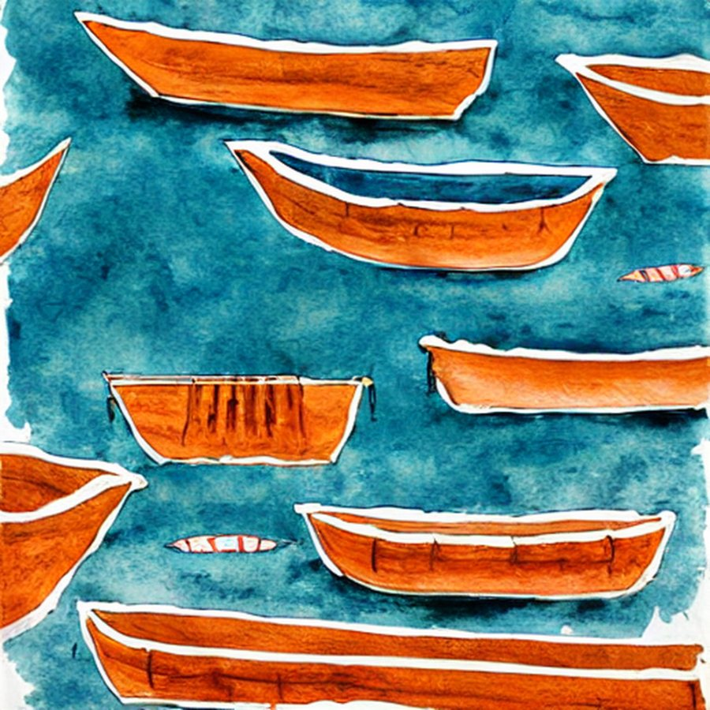 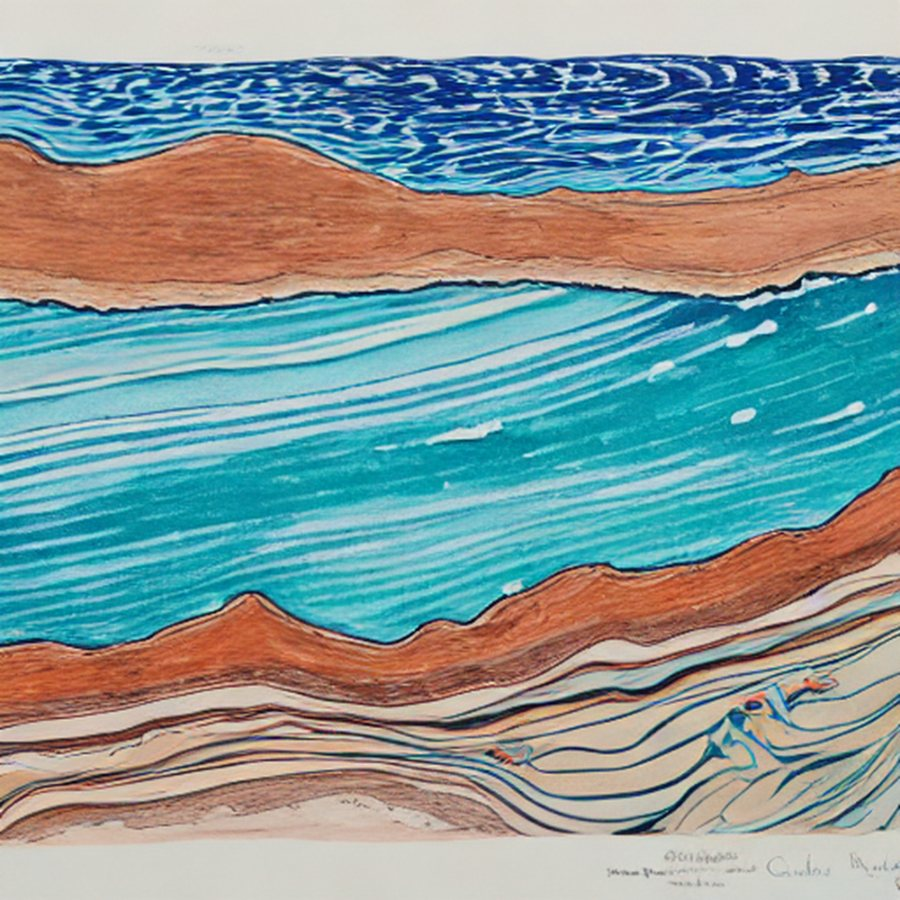 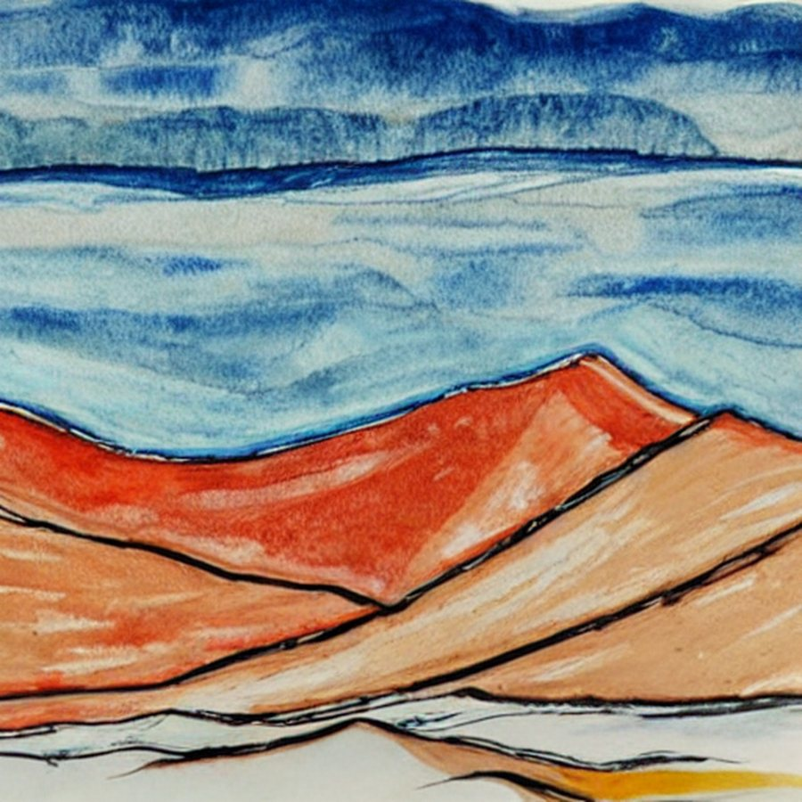 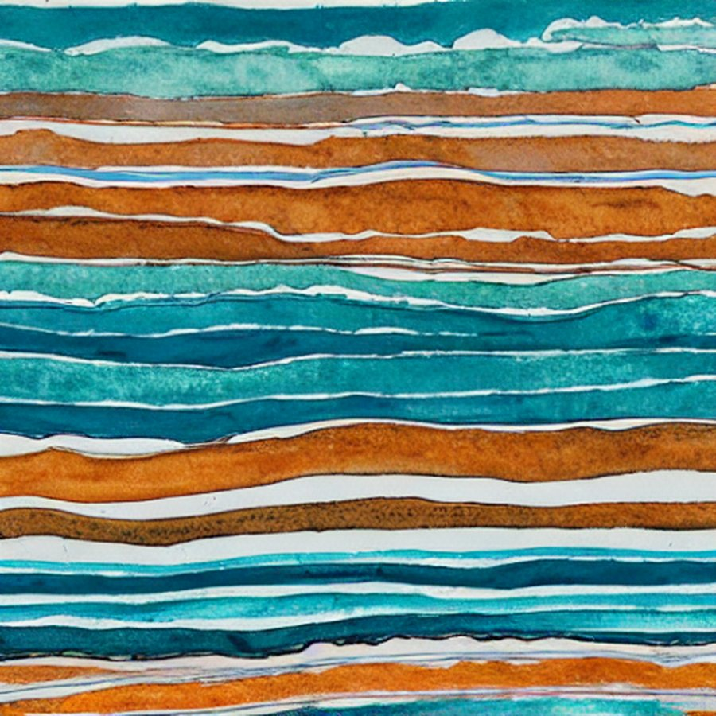 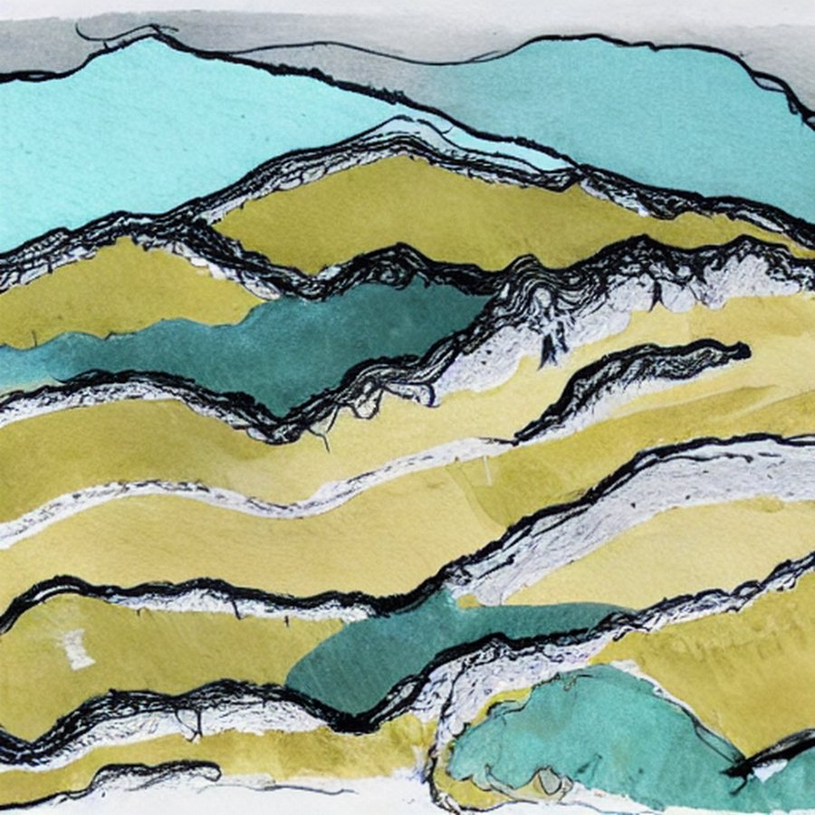 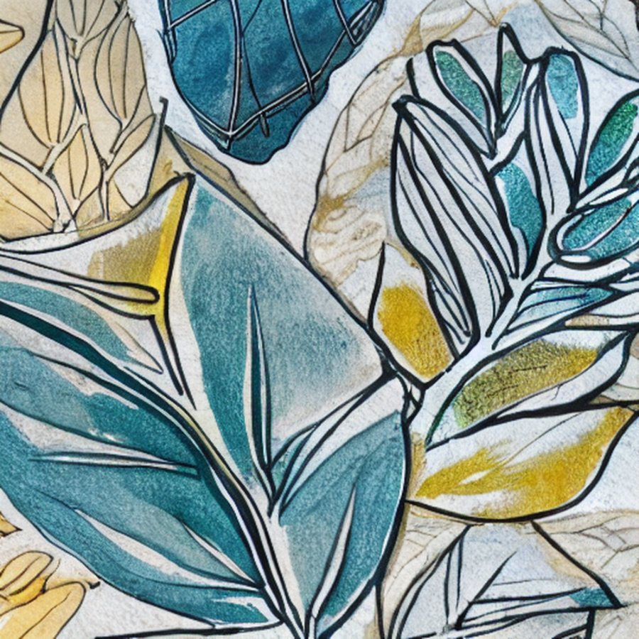

Everything is watercolour and gouache on cotton paper. **Terracotta acts, aegean links, saffron highlights** — four to six colours carry a composition. Three faces, three jobs: GFS Didot for display, Commissioner for annotation and UI, Source Serif 4 for body. Corner radius is zero and there are no shadows; depth is a 2px carbon rule, a 1px hairline, or a flat pigment field — never a blur.

Sixteen functional icons on a 24px keystone grid, drawn at the system's own 2px carbon
rule — motifs stay paintings, icons do the interface jobs, and the two never trade.

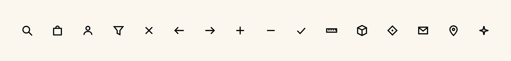

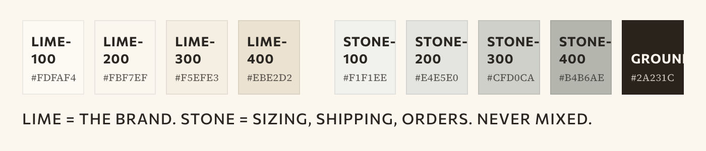
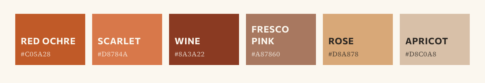
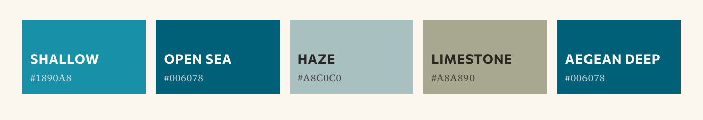

### In use — two products, one system

A second product, a harbourside taverna, built from the same tokens, registers and rules with nothing reskinned:

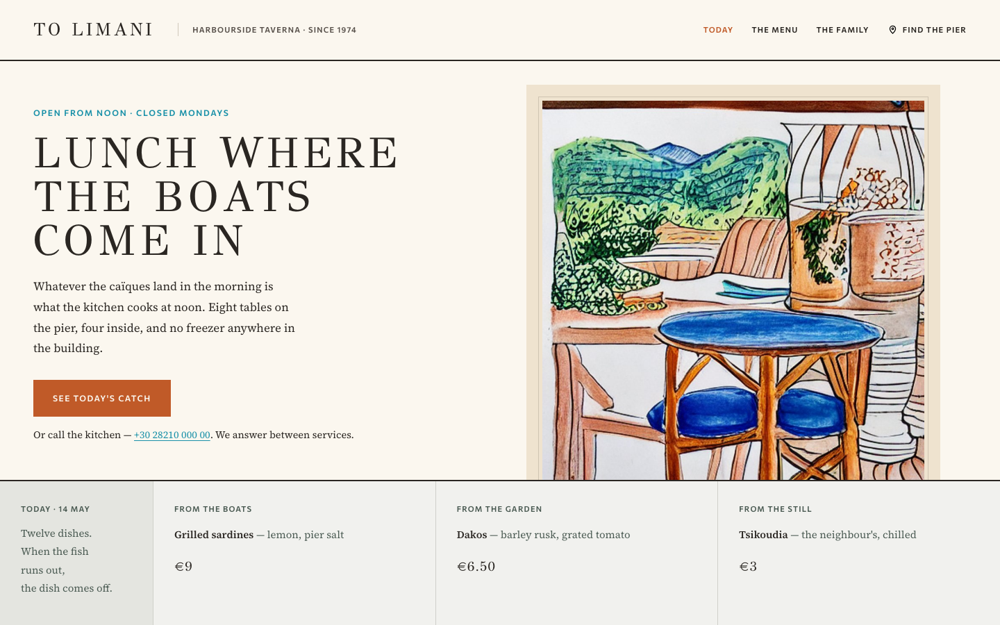

The flagship case — the jewellery workshop — across four channels:

| | |
|---|---|
| 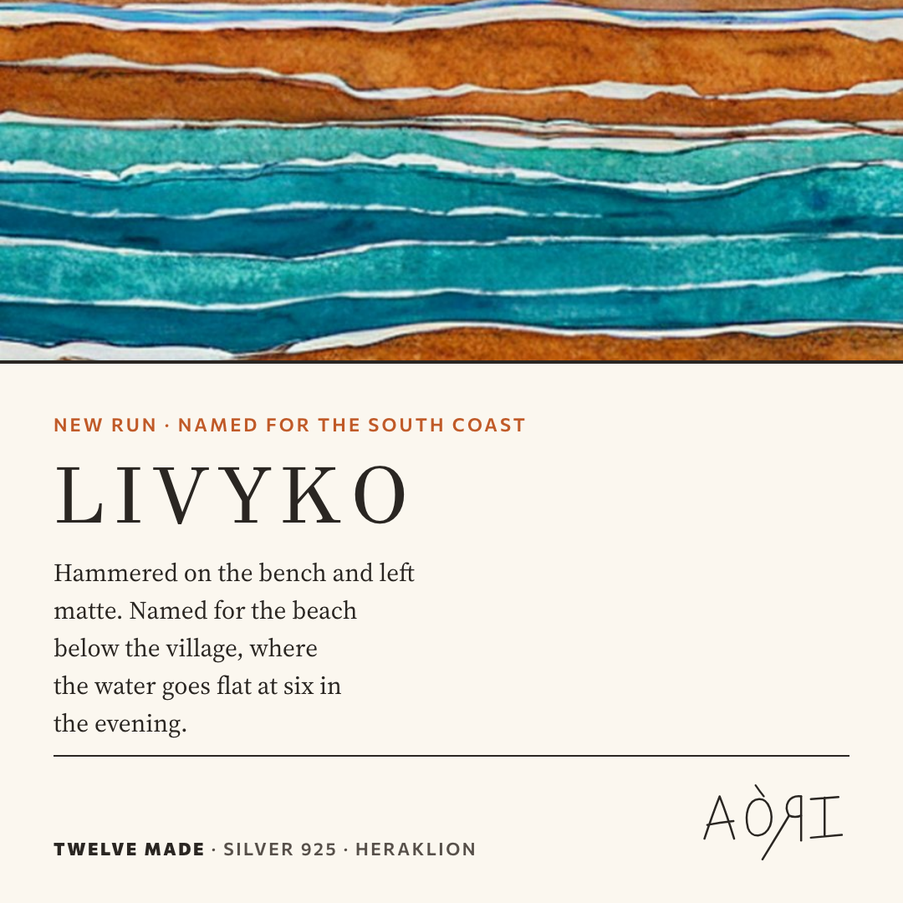 | 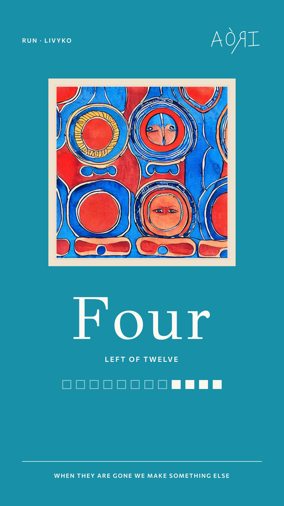 |
| 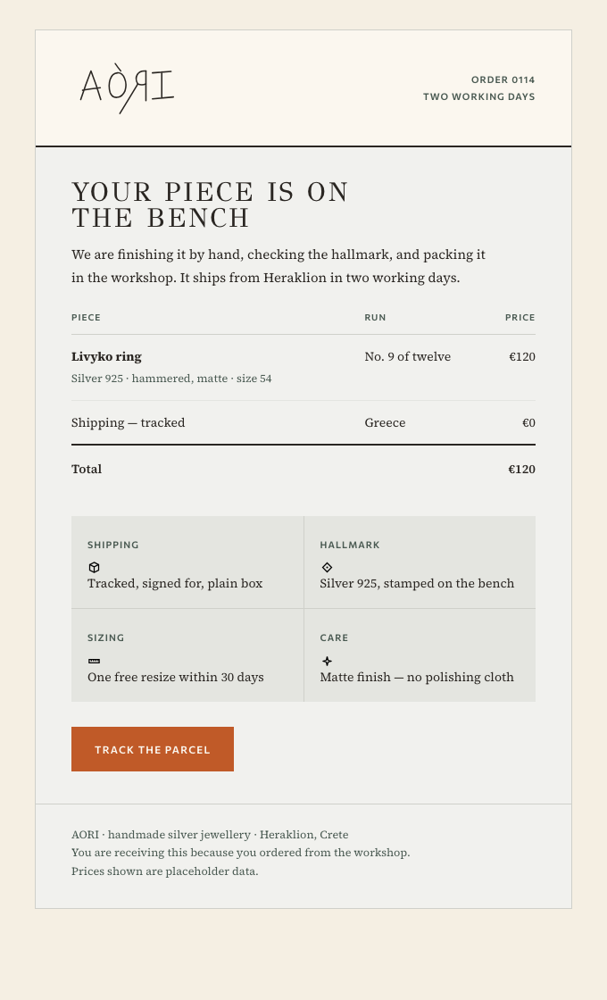 | 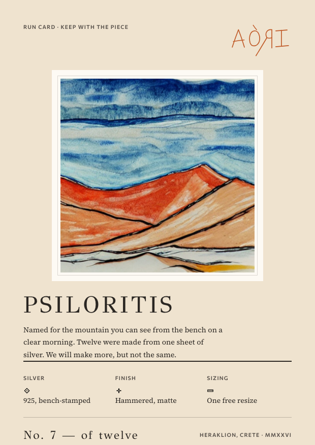 |

**Taking it to a new product.** The palette is not decoration-first — the thirteen pigments are sampled by frequency from the paintings. Commission plates in the same hand (or start from this library) and let the palette come from the paintings; the registers, type, icons and rules carry unchanged.

### What is real and what is placeholder

- **No logo was invented.** The wordmark supplied by the workshop is the only mark. The five painted files that arrived named as logos contain no readable brand name; they are filed as **emblems** and always sit subordinate to the wordmark.
- **The product data is invented in both cases.** The workshop exists (the Instagram account is real); its collections, prices, run counts and address here are placeholders. The taverna is entirely fictional. Both are labelled as such wherever they appear.
- **Eight photography paths hold generated placeholder tiles** that say so on their face. The photography route is still an open decision.

### Contents

| | Section | Status |
|---|---|---|
| 01 | Philosophy — what the workshop is, and the voice it speaks in | Documented |
| 02 | Logotype — clear space, minimums, placement, eight misuses | Documented |
| 03 | Colour — two registers, laid flat and opaque | Documented |
| 04 | Typography — three faces, three jobs | Documented |
| 05 | Illustration & photography — the painted hand, and the open question | Documented |
| 06 | Iconography — the motif law, plus a sixteen-icon functional set | Documented |
| 07 | Grid & layout — spacing, edges, elevation, motion | Documented |
| 08 | Application — components, templates, storefront kit | Documented |
| 09 | In use — two products: the workshop across four channels, and a taverna website | Documented |

20 components, 35 guideline pages, 187 tokens (also machine-readable in `tokens/tokens.json`), 16 icons, 4 worked cases. `styles.css` is the entry point; `SKILL.md` carries Agent Skills front matter for use in Claude Code.

### More

- [The written specification](docs/SPECIFICATION.md) — voice, colour, type, illustration, shape, motion, iconography
- [Repository index and what shipped](docs/INDEX.md)
- [Provenance, open decisions and known gaps](docs/PROVENANCE.md)
- [`docs/aori-design-system.pdf`](docs/aori-design-system.pdf) — the whole system as one exported document
