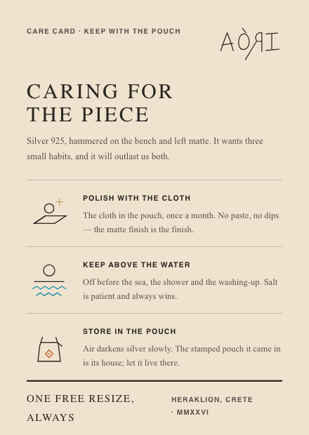

# AORI Design System

Watercolour plates, flat pigment, zero radius, no shadows — a design system for brands
that should feel handmade. **Terracotta acts, aegean links, saffron highlights.**

     

**[Brand book (PDF)](docs/aori-brand-book.pdf)** · [brand book (live)](index.html) · [specification](docs/SPECIFICATION.md) · [overview](docs/OVERVIEW.md) · [provenance](docs/PROVENANCE.md) · [Figma library](https://www.figma.com/design/6TQy0y8XuQQPpGThxXeNlw)

```html
<link rel="stylesheet" href="styles.css">

<h1>Psiloritis</h1>
<p>Twelve were made from one sheet of silver. Four are left.</p>
<button style="background:var(--accent);color:var(--text-on-pigment)">Add to bag</button>
```

| | |
|---|---|
|  |  |

Six worked cases in `cases/`, plus a taverna built from the same tokens with nothing
reskinned. All product data is invented and labelled as such — the rest of the detail
lives in [docs/OVERVIEW.md](docs/OVERVIEW.md).
