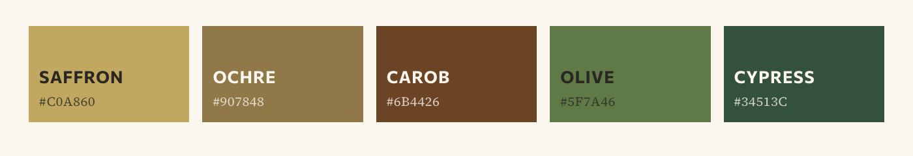
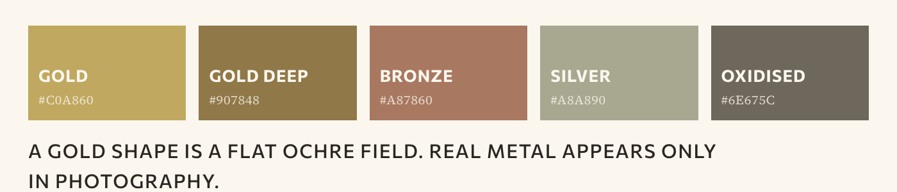
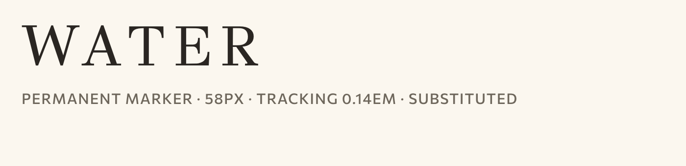
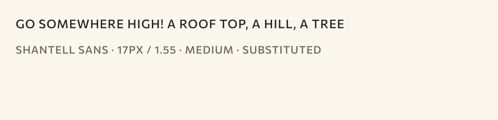
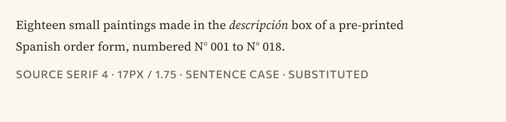
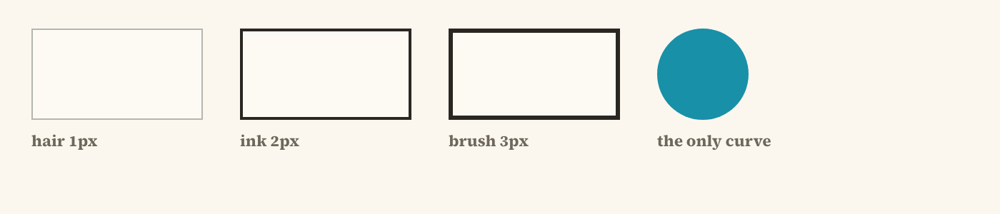
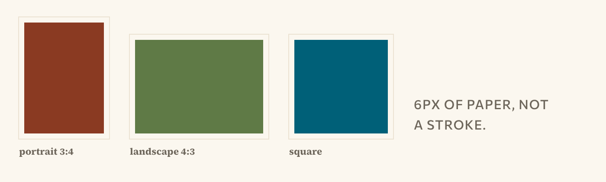
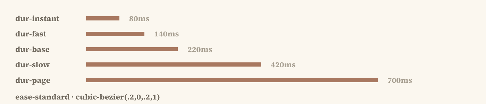

# AORI Design System

AORI (written **AÓRI**, styled AŌRI in the Instagram bio) is a handmade silver jewellery
workshop in Heraklion, Crete. Pieces are made in **runs of twelve**, each run named for a
place on the island. When a run is gone it is not remade — the next sheet of silver is a
little different, and so is the next run.

The system exists to make one thing possible: a shop, a document or a post that looks like
it came from a workshop rather than a brand studio.

**[Open the brand book →](index.html)** — the whole system on one page, in the eight
sections a complete brand book carries. The rest of this file is the written specification.

### Contents

| | Section | Status |
|---|---|---|
| 01 | [Philosophy](#content-fundamentals) — what the workshop is, and the voice it speaks in | Documented |
| 02 | [Logotype](#visual-foundations) — the wordmark, its colourways, the emblems beneath it | Partial |
| 03 | [Colour](#colour) — two registers, laid flat and opaque | Documented |
| 04 | [Typography](#type) — three faces, three jobs | Documented |
| 05 | [Illustration & photography](#illustration) — the painted hand, and the open question | Documented |
| 06 | Iconography — motifs are circles, patterns are squares | Partial |
| 07 | [Grid & layout](#surface-edge-depth) — spacing, edges, elevation, motion | Documented |
| 08 | Application — components, templates, storefront kit | Documented |

### The paintings

     

### Colour

Terracotta acts, aegean links, saffron highlights. Four to six colours carry a composition.

### Type

### Shape and motion

> Corner radius is zero and there are no shadows. Depth is a 2px carbon rule, a 1px
> hairline, or a flat pigment field — never a blur.

---

## What was provided, and what was made

**Provided by the user**

| Source | What it is |
|---|---|
| `@aori__jewelry` (Instagram) | 6 posts, 1,651 followers. Bio: "AŌRI Handmade Jewelry / Silver925 Jewelry". Read from a user screenshot — Instagram blocks automated access. |
| Painted artwork, 39 files | Watercolour and gouache on cotton paper. Places, figures, motifs, repeats, grounds, emblems. Staged in `assets/illustrations-v2/` (print masters) and `assets/illustrations-v2-web/` (900px web copies). |
| `wordmark.svg` | The brand mark, a vector trace of painted lettering. |
| A prior design system | 20 compiled components, recovered from its bundle and rebuilt as source. The recovered source is **not** in this repository. |

**Made here, and flagged as such**

- **Photography** — nine free-licence Pexels photographs were sourced into
  `assets/photography/` and referenced throughout the guidelines. **The image files are not
  in this repository** — they were absent from the source folder this was published from.
  The eight paths the guidelines call for now hold generated placeholder tiles that say so
  on their face, so the pages lay out correctly and nothing passes itself off as a
  photograph. None showed an AORI piece in any case. See *The photography problem* below.
- **Grounds** — three procedural receipt-paper textures in `assets/textures/`. A real scan
  drops straight in over them.
- **Product data** — collections, prices, run counts and the Heraklion workshop are all
  invented, at the user's instruction, and labelled placeholder wherever they appear.

**No logo was invented.** The wordmark supplied by the user is the only mark. The five
painted files that arrived named as logos contain no readable brand name; they are filed as
**emblems** and always sit subordinate to the wordmark.

---

## Content fundamentals

The voice is a maker talking, not a brand announcing.

**Person.** First person plural for the workshop, second person for the reader. "We make
twelve. When they are gone we make something else." Never "AORI is proud to present".

**Casing.** Sentence case in prose. Uppercase only in the annotation voice — labels,
buttons, metadata, section markers — where it is always tracked. Display headings are
uppercase and tracked; body copy never is.

**Numbers are load-bearing.** Twelve in a run. Four left. Silver 925. 24 mm. Two working
days. The brand's honesty is arithmetic, so numbers are stated plainly and never rounded up
for effect.

**Scarcity is stated, never sold.** "Four left of twelve", not "Selling fast". A closed run
says "All twelve gone" and keeps its page. The piece stays visible; only the price goes.

**No exclamation marks. No emoji.** The Instagram bio uses a decorative unicode rule
(`—— · · ✳ · ·` ) — that is the one ornamental flourish in the brand and it belongs to the
bio only.

**Greek is reserved for the brand book.** Product surfaces are Latin only. Place names keep
their Latin spelling: Psiloritis, Livyko, Elia, Knosos.

Examples, verbatim from the system:

> Made by hand in Heraklion, in runs of twelve, and named after the places they came from.

> Silver 925, hammered on the bench and left matte. Named for the beach below the village,
> where the water goes flat at six in the evening.

> We will make more, but not the same.

---

## Visual foundations

### Colour

Two registers, and they do not mix arbitrarily.

**Lime** is the ground: sun-bleached plaster, not white. `--paper-200` `#fbf7ef` carries
every page. `--stock-100` `#efe3cf` is the toned paper the paintings are drawn on, used as
the mount behind a painted plate so it never floats.

**Pigments** are sampled by frequency out of the paintings themselves — thirteen values,
laid flat and opaque, never tinted, shaded or gradiented.

- `--pigment-aegean` `#1890a8` — the loudest colour in the work. Takes the links.
- `--pigment-terracotta` `#c05a28` — acts. Every primary button.
- `--pigment-saffron` `#c0a860` — highlights. Never a field.
- `--pigment-olive` `#5f7a46`, `--pigment-forest` `#34513c`, `--pigment-rust` `#8a3a22`,
  `--pigment-clay` `#a87860`, and the water range `--pigment-water` / `-shallow` / `-haze`.

**Stone** is the clerical register: `--ledger-100` `#f1f1ee` with form-green ink
`--ledger-ink` `#4a5a52` and 1px hairlines. Used for anything administrative — sizing,
shipping, order status, specification.

Rule: **terracotta acts, aegean links, saffron highlights.** Four to six colours carry a
composition; never more. Maximum two background colours in any one document.

### Type

Three faces, three jobs. All Google-hosted; **no licensed font files were provided**, and
these are the closest available match to the painted lettering.

| Role | Face | Use |
|---|---|---|
| Display | **GFS Didot** | Names, headings, prices. Uppercase and tracked `.09em`–`.14em`. Greek-capable, which is why it won. |
| Annotation / UI | **Commissioner** | Labels, buttons, metadata, nav. Always uppercase, tracked `.07em`–`.14em`, weight 600. |
| Body | **Source Serif 4** | Prose, descriptions, form values. Sentence case, 15–17px, line-height 1.7–1.75. |

Minimum sizes: 24px in a 1920×1080 slide, 12pt in print, 44px hit targets in a mobile mock.

### Illustration

**One hand, two jobs.** Everything is watercolour and gouache on cotton paper — saturated
fields held inside a drawn contour, the paper reading through the lighter passages, nothing
opaque white, nothing greyed to recede.

- **The full plate** — 23 places, figures and still lifes. Mounted with a 5px unpainted
  margin on toned stock.
- **The lifted detail** — 6 motifs, each one cut out of a finished painting. Four are
  knocked out of their painted field, two are cropped to a disc. **All six are circles.**
  A mark is never invented: if a subject has no painting, it has no mark.

**Motifs are circles. Patterns are squares.** That is the shape rule, and it holds
everywhere.

Three patterns (`wave`, `spiral`, `olive`) at three strengths — full for packaging and one
hero band, 30% for section grounds, 8% behind long prose. Never two patterns on one screen.
Applied as a `::before` layer so the opacity never touches the text.

### The photography problem — read this before shooting anything

The paintings are the loudest thing in the system: maximum chroma, hard contour, white
paper. Every treatment that makes a photograph quieter moves it *further* from them.
Converting a photograph into flat washes with a drawn edge is image generation, not CSS.

Four routes, documented in full at `guidelines/photo-blending.html` §05b:

1. **Paintings are the product imagery.** Photographs live only on a plain spec panel. Free.
2. **Have the pieces painted.** Send the artist the actual jewellery. Costs artist time.
3. **Shoot on the painted paper.** Lay pieces on a real painted sheet in daylight. One afternoon.
4. **Make the split the identity.** Painted world for romance, clerical sheet for evidence. Free.

**Recommendation: 3 now, 2 over time.** This decision is still open.

Nine positions on how a photograph may sit beside a painting are rendered live at
`guidelines/illustration-library.html` §04.

Where photography is untreated regardless of route: sizing and fit shots, the one detail
shot showing hallmark and finish, and anything sent to a stockist or a magazine.

### Image jobs — which picture goes where

Documented in full at `guidelines/image-jobs.html`.

| Surface | Painting | Photograph |
|---|---|---|
| Home hero | **Yes** | Never — a photograph does not open the site |
| Collection grid tile | **Yes**, 3:4 | No — a tile is a *place*, not a piece |
| Product grid tile | No | **Yes**, square |
| Product hero and gallery | No | **Yes** |
| Sizing, shipping, spec | No | **Yes**, untreated |
| Packaging | **Yes** | Never |
| Instagram place post | **Yes** | No |
| Instagram product post | No | **Yes** |

Photographs go **full bleed with no border** — a border on a photograph reads as a frame,
and the brand does not frame things. Paintings keep the toned mount and the 5px unpainted
margin.

### Surface, edge, depth

- **Corner radius is zero.** Everywhere. The only circles in the system are the motif discs
  and the platform-imposed Instagram avatar mask.
- **No shadows.** Depth comes from a 2px carbon rule, a 1px hairline, or a flat pigment
  field — never from a blur.
- **Cards** are a 1px `inset` box-shadow on `--paper-400`, or a flat `--paper-100` panel.
  No border-radius, no drop shadow, no coloured left border.
- **Rules** are structural: 2px carbon `--rule-ink` for a section break, 1px
  `--rule-hair` for a row division inside one.
- **No transparency or blur** except one case: a `linear-gradient` scrim over a hero
  painting so white type stays legible. Never a frosted panel.

### Motion

Restrained to the point of near-absence. Opacity and position only, 140–220ms, standard
ease. No bounce, no spring, no scale-on-hover, no parallax, no scroll-triggered reveals.

- **Hover:** the underline appears, or opacity lifts from .62 to 1. Colour does not change.
- **Press:** the pigment darkens one step (`--accent-press`). Nothing shrinks.
- **Focus:** a 2px `--focus-ring` outline in deep water. Never removed.
- **Disabled:** `--text-faint` on `--paper-300`, no pointer.

---

## Iconography

**There is no icon set, and that is deliberate.** The six painted motif discs do the job an
icon library would do elsewhere — a section opener, a divider, a stamp on a pouch, a
highlight cover. Each belongs to a place, so using one is a claim about which place a page
is about.

- Minimum 40px. Below that the wash muddies; use nothing instead.
- On lime, on stock, or on a pigment field — the knocked-out marks hold on all three.
- One motif per page or per post. Two is a pattern, and patterns have their own rules.
- **Never redraw one.** A mark that does not exist in a painting does not exist.

Where a functional glyph is genuinely needed, the system uses **typographic characters** in
Commissioner — `+` and `−` for accordions, `·` as a separator, `/` in breadcrumbs. No icon
font, no SVG sprite, no emoji. The `Mark` component wraps the motif set; it is **not** a
logo component.

---

## Index

**Root**

- `styles.css` — the entry point. `@import` lines only.
- `README.md` — this file.
- `SKILL.md` — Agent Skills front matter, for use in Claude Code.

**`tokens/`** — 187 custom properties across `colors`, `typography`, `fonts`, `spacing`,
`shape`, `elevation`, `motion`, `surfaces`, `patterns`.

**`base/`** — `elements.css`, the element-level defaults.

**`components/`** — 20 components, each with `.jsx`, `.d.ts` and `.prompt.md`, plus one
`.card.html` specimen per group.

| Group | Components |
|---|---|
| `core/` | Button, Tag, Mark, Rule |
| `content/` | Plate, PlateCard, Caption, PullQuote, Dot, DotChain, StepList |
| `forms/` | Input, Textarea, LedgerField, Select, Checkbox |
| `feedback/` | Notice, Dialog |
| `navigation/` | NavBar, Tabs |

**`guidelines/`** — 34 pages: the specimen cards (type, colour, spacing, shape, elevation,
motion, brand) plus the decision documents `photo-blending.html`,
`illustration-library.html`, `image-jobs.html`, `type-decision.html`, `asset-audit.html`,
`illustration-proposals.html`, `photography-standins.html`, `logo-proposals.html`.

**`templates/`** — starting folders a consuming project can copy.

- `brand-book/` — A4 landscape, print-ready.
- `collection-grid/` — the shop index; closed runs stay visible.
- `media-kit/` — the press sheet.

**`ui_kits/storefront/`** — home and product page, click-through, composed from the
components.

**`assets/`** — `illustrations-v2/` (39 print masters), `illustrations-v2-web/` (41 900px
web copies), `motifs-v2/` (discs and the four SVG marks), `patterns/`, `textures/`,
`logos/`, `products/`, `photography/` (placeholders — see below).

**`lib/`** — the render runtime the specimen cards and templates load: `ds-bundle.js`,
`support.js`, `doc-page.js`. Not authored here and not part of the language; kept only so
the HTML in `components/`, `templates/` and `ui_kits/` opens.

**`docs/`** — `aori-design-system.pdf`, the whole system as one exported document.

---

## Intentional additions

- **`Mark`** — a wrapper for the painted motif discs. The source had no icon component and
  something had to enforce the 40px minimum and the circle shape.
- **`LedgerField`** — the clerical register needed a form field visually distinct from the
  warm register. Without it the stone palette had no component to live in.

Two further additions were specified but never built, and are **not** in `components/`:
**`Stamp`** (the emblem-as-seal, which the emblem pairing rule wants) and **`LedgerRow`**
(the clerical table row that would finish the stone register). Earlier drafts of this file
listed both as if they shipped.

---

## Open decisions

1. **The photography route** — 1, 2, 3 or 4 above. Blocks the shop pages from being real.
2. **Nine positions on photography** — which one, if route 2, 3 or 4.
3. **Fonts** — GFS Didot, Commissioner and Source Serif 4 are Google Fonts substitutions.
   If AORI owns licensed faces, send the files.
4. **The wordmark** — the file is a vector trace with an oil-pastel filter that drops out in
   print and in any capture. The traced outlines are used flat, so letterforms are exact and
   the pastel texture is gone. Send the original painted artwork at full size.
5. **Three motifs have no painting** — a spiral, a hoop and a beaded strand painted as marks
   would complete the set. Currently two of the six are disc crops standing in.

---

## This edition

Published from the working folder, which held roughly 1 GB of generator output, scratch
runs and duplicated assets around a much smaller system. What survives is the system; what
was cut is listed here so nothing looks lost.

**Cut**

- Generator and experiment code — `generate.py`, `organize.py`, `trials.py`, `run_both.py`,
  `shot-list.json`, `__pycache__/`, and the paint engine and prior bundle.
- Experiment output — `generated-v2/`, `generated-rejected/`, `generated-test/`,
  `generated-sample/`, `generated-proving/`, `trials/` (~270 MB of candidate renders).
- `uploads/` (455 MB) — hash-suffixed duplicates of assets that already live under
  `assets/` with clean names. Every document that pointed into it now points at the
  canonical file instead.
- Source material that is not the system — `aori-images/` (phone photographs),
  `illustrations-refernce/`, an empty `assets 2/`, `.DS_Store`, `.thumbnail`,
  `thumbnail.html`.
- `_ds_manifest.json` and `_adherence.oxlintrc.json` — both generated against the compiled
  bundle, and stale the moment the source moved.

**Repaired**

The documents carried 199 broken image references before this pass and carry none now.

- 101 references into `uploads/` were repointed to `assets/illustrations-v2-web/`, or to
  the new `assets/audit/` for the 21 plates and rejected examples that only
  `asset-audit.html` uses.
- 69 references to three folders that never existed in this tree — `assets/illustrations/`,
  `assets/motifs/`, `assets/brand-images/` — were resolved to their real homes under
  `illustrations-v2-web/` and `motifs-v2/`.
- Four SVG marks (`crescent`, `mountain`, `sea`, `wall`) and `logos/01-wordmark.svg` were
  recovered out of `uploads/` before it was dropped; they were referenced but unfiled.
- The specimen cards and templates loaded four identical copies of `support.js` and a
  bundle from the repository root. Those are deduplicated into `lib/`.

**Corrected in this file**

The component table listed `Stamp` and a `data/` group containing `LedgerRow`. Neither
exists; both are now marked as specified-but-unbuilt. The colour cards printed 22 hex labels that did not match the tokens they render; those are now written from the tokens. An earlier pass of this file changed the token count from 187 to 192 — 187 was right (unique properties; 192 counted duplicate declarations) and it is restored.

**Known gaps**

- The eight photography placeholders described above.
- `lib/` is compiled output, not source. The specimen cards and templates will not render
  without it, which is the only reason it is here.
- `assets/illustrations-v2/` is 180 MB of print masters. Everything on screen uses the
  900px copies in `illustrations-v2-web/`; the masters are here for print only, and are the
  obvious first candidate for Git LFS if the repository needs to get smaller.

---

## Reference material removed

The working folder carried two sets of material that belong to someone else, and neither is
in this repository:

- **`reference/`** — the prior design system's recovered source, its quarantined UI kit, the
  artist research and the theme references.
- **`assets/audit/`** and the `asset-audit.html` page that displayed it — the thirty-three
  scans supplied as the style brief. The system's own audit page described them as
  *"belonging to another artist"* and ruled that they *"must not appear in any AORI
  output."* Two illustration tiles that drew on the same set were removed from
  `step1-palette-and-set.html` and `illustration-proposals.html`.

Both were present in the first published commit. That commit was replaced rather than
added to, so the material is not recoverable from the history either.
