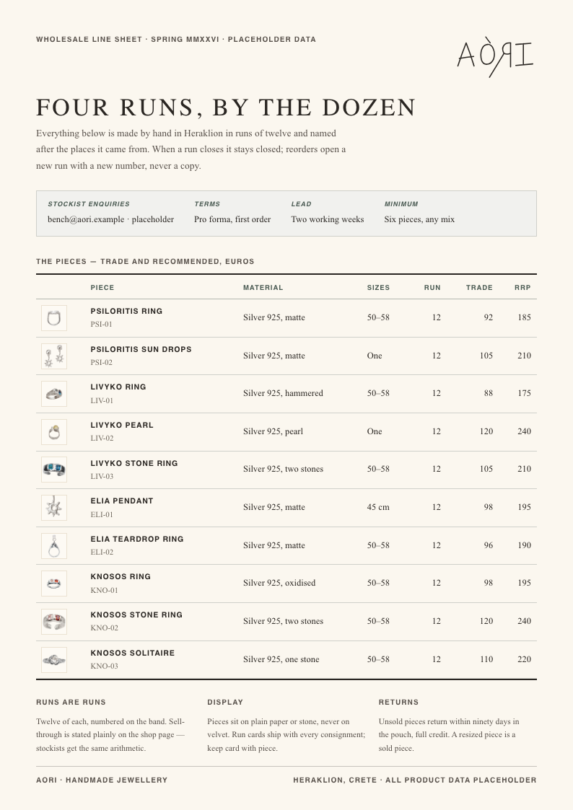

# AORI Design System

Watercolour plates, flat pigment, zero radius, no shadows — a design system for brands
that should feel handmade. **Terracotta acts, aegean links, saffron highlights.**

     

- **[Brand book (PDF)](docs/aori-brand-book.pdf)** — the guidelines as one printable document
- **[Brand book (live)](index.html)** — the whole system on one page
- **[Written specification](docs/SPECIFICATION.md)** · [repository overview](docs/OVERVIEW.md) · [provenance](docs/PROVENANCE.md)

## Use it

```html
<link rel="stylesheet" href="styles.css">

<h1>Psiloritis</h1>
<p>Twelve were made from one sheet of silver. Four are left.</p>
<a href="#">Read how it is made</a>
<button style="background:var(--accent);color:var(--text-on-pigment)">Add to bag</button>
```

Tokens carry everything: `--accent` acts, `--link` links, `--status-*-ink` speaks. React
components live in `components/`, each with a `.prompt.md` for agent use; `SKILL.md` makes
the repo a Claude Code skill. `tools/check_contrast.py` gates every colour role at its
WCAG bar.

## In use

| | |
|---|---|
|  |  |
|  |  |

Six worked cases in `cases/` — order email, run card, care card, line sheet, social
post and story, plus a taverna website built from the same tokens with nothing reskinned.
All product data is invented and labelled as such; details in
[docs/OVERVIEW.md](docs/OVERVIEW.md).
